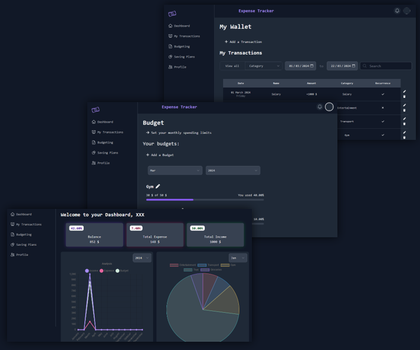

# Expense Tracker
Expense Tracker is a simple and efficient web application designed to help you track your expenses. It provides a user-friendly interface for recording and categorizing your spending, allowing you to gain insights into your financial habits and manage your budget effectively.


## Features
- User Authentication: Register an account or log in securely to track your expenses.
- Expense Logging: Add new expenses with details such as date, category, description, and amount.
- Expense Categories: Categorize your expenses for better organization and analysis.
- Expense History: View a detailed history of your expenses, including date, category, description, and amount.
- Expense Summary: Get an overview of your spending habits with a summary of total expenses by category.
- Search and Filters: Easily search and filter your expenses based on various criteria.
- Responsive Design: Access and use the application seamlessly on desktop, tablet, and mobile devices.

## Technologies Used
Expense Tracker is built using the following technologies:
- Frontend: HTML, CSS, Typescript, React, Chart.js
- Backend: Node.js, Express.js, MongoDB
- Authentication: JSON Web Tokens (JWT), googleOAuth 


## Getting Started

- To run Expense Tracker locally, follow these steps:
1. Clone the repository from GitHub:
```
git clone https://github.com/oebelus/expense-tracker.git
```

2. Navigate to the project directory: `cd expense-tracker`

3. Install the dependencies for both frontend and backend:

```
cd frontend
npm install
cd ../backend
npm install
```
4. Set up environment variables:
- Create a .env file in the backend directory, add the following variables to .env:
```
MONGODB_URI=your_mongodb_uri
CLIENT_ID=google_oauth_client_id
CLIENT_SECRET=google_oauth_client_secret
OAUTH_REDIRECT_URL=google_oauth_redirect_url
```

5. Start the backend server: `npm start` 

6. In a new terminal, start the frontend development server:
```
cd ../frontend
npm start
```
7. Open your browser and visit http://localhost:4000 to use Expense Tracker locally.